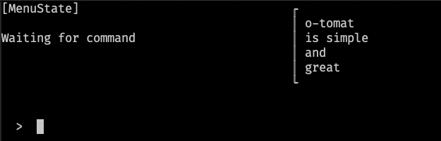

# o-tomat 🍅

Tomat is your assistant

o-Tomat know his state

How Tomat can be helpful ?

By stacking your commands of course !

## Current look

## Design values

### Interactivity
Every word that you type have a consequence, like in real life:
If you want to improve, you must try, see the results and retry

### Modularity

If you want to add a functionnality to *tomat*, you can do it !

You don't have to understand how our progam works, just use our intuitive API

### Ergonomy

One word

One command

One visible consequence

One part of our brain is dedicated to create sentances, another to see the shape of objects. Why not use them ?

### Pedagogy

Documentation is integrated: you don't have to find the right man page, just read the hints tomat gives you !

## Construction
Tomat is based on the idea of a [push-down automaton](https://en.wikipedia.org/wiki/Pushdown_automaton)

The goal is that most of the state of the program will be visible by the user.

We don't hide details: we help the user to understand them !

## Thesis

I built this thing to answer this very simple question:

> How can an extensible modular pile-based automata be usefull for human-to-machine communication, and what could be the effects of the instant feedback paradigm on the design of human-to-computer interfaces ?

## Future

We will take this project **to the moon !** 🚀
